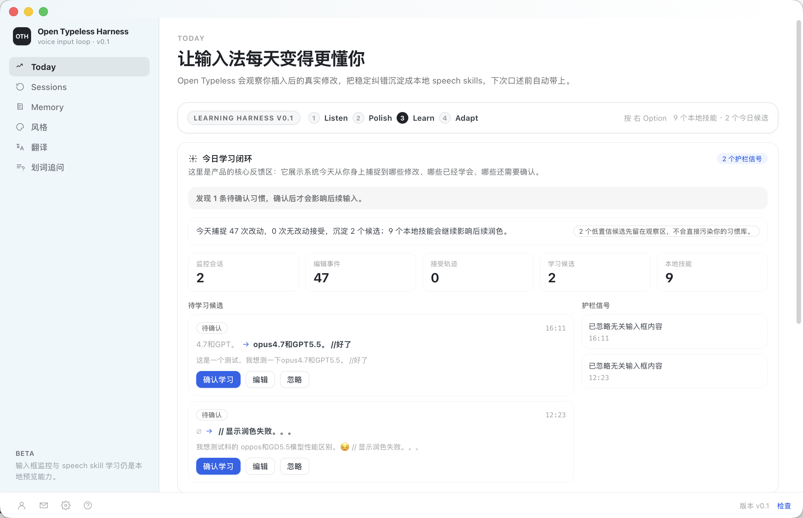

# Open Typeless Harness

  

  <strong>从真实修正中学习你常用词汇的语音输入。</strong>

  • 聚焦输入框口述 • LLM 润色 • 本地 Speech Skills •

  <a href="README.md">English</a> •
  <a href="#快速导航">快速导航</a> •
  <a href="#功能">功能</a> •
  <a href="#它如何学习你的习惯">学习模型</a> •
  <a href="#安全模型">安全模型</a>

  
  
  
  

> [!IMPORTANT]
> **从一次性语音输入，变成会改进的输入闭环。**
>
> 普通语音转文字会反复错在同一批地方：产品名、项目名、中英混排术语，以及你每次插入后马上手动修掉的小错误。
>
> Open Typeless Harness 把这些改动当成学习信号。它先转写、润色、插入当前输入框，再观察你如何修正这段文本，让后续口述越来越贴近你的词汇。
>
> 核心判断很简单：**每一次文字落地后的修正，都应该让下一次输入更准。**

## 快速导航

> [!TIP]
> **我是用户** -> 打开应用，把光标放进任意输入框，口述，然后正常修正文本。你的修正轨迹就是学习信号。
>
> **我是 agent** -> 产品闭环是 `ASR transcript -> LLM polish -> focused-field insertion -> post-insertion edit monitor -> local speech skills`。

  

  

  真实 App 操作预览。点击动图打开 MP4。

## 功能

- **聚焦输入框插入**：在你正在使用的 app 里直接口述，不需要切到单独编辑器。
- **LLM 润色输出**：文本落地前先清理口语化表达和混乱结构。
- **插入后改动监控**：观察用户真正修改了什么，而不是只依赖 ASR 置信度。
- **本地 speech skills**：把反复出现的修正沉淀成本地记忆，供后续润色检索。
- **中英混排词汇**：处理 `type script -> TypeScript`、`知呼 -> 知乎` 这类常见纠错。

## 它如何学习你的习惯

1. 你在当前聚焦输入框里口述。
2. Open Typeless Harness 插入润色后的文本。
3. 插入后的短时间窗口内，edit monitor 对比插入文本和你的手动改动。
4. 稳定、反复出现的修正会沉淀成本地 speech skill。
5. 后续口述时，相关 speech skill 会在 LLM 润色前被检索出来，让模型先看到你的词汇习惯。

这不是全局自动纠错，而是基于真实插入后改动建立的 correction-native memory loop。

## 安全模型

Open Typeless Harness 是输入层，不是自主 agent。它把文字写进你正在使用的输入框，不应该主动替你执行任务。

纠错证据和 speech skills 默认留在本机。歧义修正应该成为 contextual skill，而不是危险的全局 find-and-replace。

## 状态

Open Typeless Harness 目前是 technical preview，是基于 OpenLess 桌面运行时的 OpenClaudex 实验性 fork/fusion。

当前重点：

- 聚焦输入框口述
- LLM 润色插入
- 插入后的改动监控
- 本地 speech-skill 学习

## 致谢

基于 OpenLess 桌面运行时构建，并继承 MIT license。

## License

[MIT](LICENSE)
